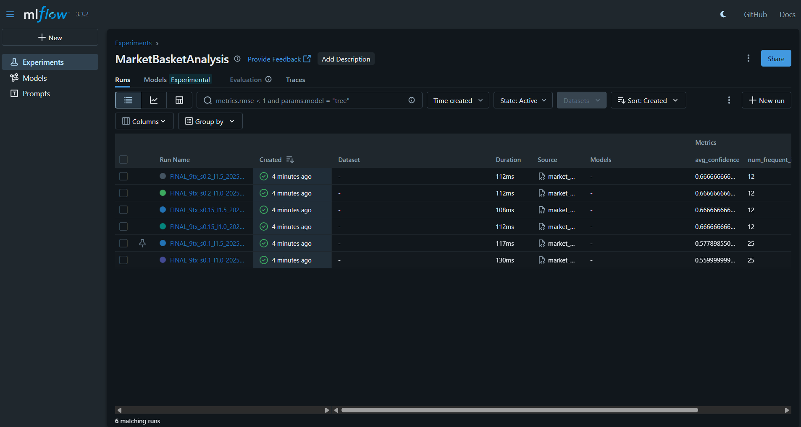
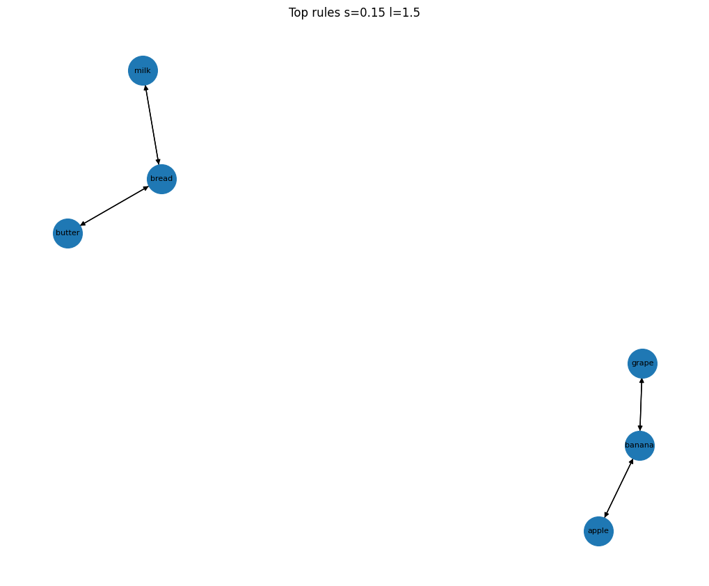

\# 🛒 Market Basket Analysis with DVC + MLflow


This project demonstrates \*\*Market Basket Analysis\*\* (Apriori + Association Rules) combined with a full \*\*MLOps workflow\*\*:


\- \*\*MLflow\*\* → experiment tracking (parameters, metrics, artifacts)

\- \*\*DVC\*\* → reproducible pipelines, dataset + code versioning

\- \*\*Git\*\* → source control


\## 🚀 Pipeline

\- Input: `transactions.csv` (one transaction per line, comma-separated items)

\- Output: association rules, frequent itemsets, visualizations

\- Managed with `dvc repro`


## Results & Visualizations

### MLflow Experiment Tracking


### Item supports


### Association Rules Network



\## 🔧 How to Run

```bash

git clone https://github.com/rakshaanagendra/market-basket-mlops.git

cd market-basket-mlops

pip install -r requirements.txt

dvc repro

mlflow ui


